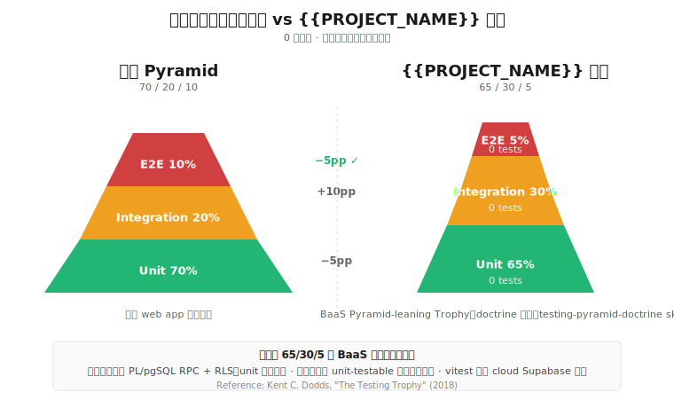

# Testing — Spec Hub

{{PROJECT_NAME}} 的 canonical 測試 spec。本目錄管「**為什麼這樣測**、**怎麼寫**、**蓋什麼**、**現在到哪**」。

## 概念來源

形狀與 tier 角色的 doctrine 在 [`test-strategy`](https://github.com/AndyLai13/andy-marketplace/tree/main/toolbox/skills/test-strategy) skill。本目錄的 [shape.md](./shape.md) 是本專案的具體 instantiation（命名與比例填入專案數字），其餘檔案是工具化的延伸。

> `test-strategy` 有兩個 shape 實例：**Shape A — BaaS / serverless**（本模板預設）與 **Shape B — Android `:app`**。本目錄整套樣板（patterns / multi-tenant-safety / ci）是 BaaS instantiation；Android 專案請改用 Shape B，並交由 `android-test-funnel` 逐 feature 落地。

## 一句話形狀

目標 **Pyramid-leaning Trophy（65/30/5）**。當前實測在 [status.md](./status.md)。

## 索引

| 主題 | 連結 | 內容 |
|---|---|---|
| **形狀與策略** | [shape.md](./shape.md) | 本專案的 tier 比例目標、角色定義、不投資清單（doctrine 來自上面 skill）|
| **怎麼寫測試** | [patterns.md](./patterns.md) | Mock 樣板、AES envelope mock、`vi.doMock` 模組替換、RPC race 測試、frontend module 抽取流程 |
| **覆蓋率** | [coverage.md](./coverage.md) | 怎麼量、v8 跨 process 限制、目標門檻 |
| **多租戶安全** | [multi-tenant-safety.md](./multi-tenant-safety.md) | RLS cross-leak 測試樣板（critical pattern） |
| **CI 政策** | [ci.md](./ci.md) | 什麼跑在 push / 什麼跑在 main / fileParallelism 警示 |
| **當前狀態** | [status.md](./status.md) | 三層計數 + 覆蓋率 + 領域分布 + 仍缺（直接覆蓋更新） |

## Canonical vs Snapshot

本目錄裡的檔案分兩種性質：

| 性質 | 內容 | 更新方式 | 檔案 |
|---|---|---|---|
| **Canonical** | 形狀目標、tier 角色、pattern code 樣板、coverage 門檻 | 不會過期；改變時 edit | shape / patterns / coverage / multi-tenant-safety / ci |
| **Snapshot** | 當下實測計數、比例、per-domain 分布、仍缺項目 | 過期就覆蓋；不留歷史 batch（git log 自己看） | status |

## 怎麼更新

- **doctrine 改變**（譬如決定不再支援某個 tier） → edit `shape.md` + 在 `status.md` 重新測量
- **加新 test pattern** → edit `patterns.md`
- **跑完一輪 CI 想看現況** → 重跑 grep + coverage、覆蓋寫 `status.md`（指令在 `status.md` 末段）
