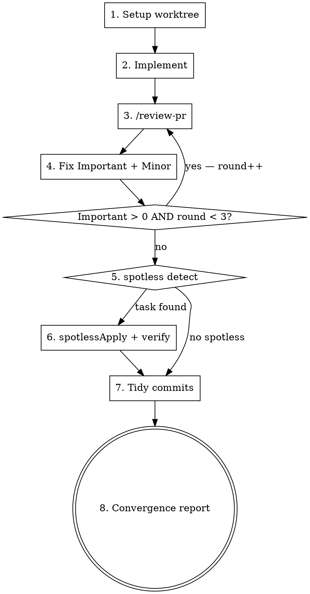

# start-task — pre-PR convergence pipeline

End-to-end pre-PR pipeline: isolated worktree → review-fix loop (max 3 rounds) → spotless (auto-detected) → commit tidy → convergence report. **Stops before opening the PR** — PR creation is intentionally out of scope.

## When to use

✅ User invokes `/start-task <work>` — `<work>` is either a Jira key matching `[A-Z]+-\d+` or free-text
✅ Working tree is clean, on `main` (or default branch), nothing in-flight
✅ Project is git-managed; PR will go through `/review-pr` (pr-review-toolkit)

## When NOT to use

❌ Already mid-implementation on a feature branch → invoke `/review-pr` directly
❌ Multi-PR feature with 5+ slices → use `/dual-loop-flow` instead
❌ Work targets a non-git environment

## Required sub-skills

- **superpowers:using-git-worktrees** — for worktree creation in Step 1
- **Code reviewer** — for Step 3. Skill tries in order: (1) `/review-pr` slash command (from `pr-review-toolkit` plugin), (2) `code-review` skill. At least one must be available.
- **superpowers:test-driven-development** — apply within Step 2 implementation

## Mandatory: create TodoWrite todos for each Step

Before executing, emit one TodoWrite todo per numbered Step (1–8) so progress is visible. The loop guard (Step 3↔4 repeat) does NOT create extra todos — just bump the round counter in the Step 3 todo's note.

---

## Workflow



### Step 1 — Setup worktree

**1a. Parse `<work>` argument:**

| Pattern matched | Action |
|-----------------|--------|
| `^[A-Z]+-\d+$` (Jira key) | Call `getJiraIssue` via Atlassian MCP with `fields: ["summary", "description", "customfield_12203"]` and `responseContentFormat: "markdown"`. Derive `<slug>` from `summary` (kebab-case, ≤40 chars). |
| Otherwise | Treat as free-text task description. Ask user once for a short kebab-case `<slug>`. Fallback if user declines: `<YYYYMMDD-HHMM>` |

**1b. Detect team branch convention (auto-adapt):**

Before constructing the branch name, look at how the team names branches in recent merges:

```bash
# Prefer gh CLI if available
gh pr list --state merged --limit 20 --json headRefName -q '.[].headRefName' 2>/dev/null \
  || git log main --merges --pretty='%s' -30 | grep -oE 'from [^ ]+' | sed 's/^from //'
```

Inspect the output. If 3+ branches share a structured pattern (e.g. `feat/YYYYMMDD/user/<key>-<slug>` or `<type>/<key>-<slug>`), adopt it:

| Detected pattern | Branch built |
|-----------------|--------------|
| `feat/<date>/<user>/<key-lower>-<slug>` | `feat/<today YYYYMMDD>/<git user.email local-part>/<key-lower>-<slug>` |
| `<type>/<key-lower>-<slug>` | `feat/<key-lower>-<slug>` (or matching type for refactor/bugfix work) |
| No clear pattern / <3 matches | Skill default: `<key-lower>/<slug>` e.g. `vb-1234/offline-cache-for-lesson-repo` |

If user-name segment is needed and `git config user.email` is unset, ask user once for the username segment.

**1c. Create worktree:**

Invoke **superpowers:using-git-worktrees** to create the worktree on that branch. If the worktree's native tool (`EnterWorktree`) fails because the session was started outside the repo, fall back to `git worktree add` under `~/.config/superpowers/worktrees/<project>/<slug>` (skill spec allows global path — no `.gitignore` modification required).

**1d. Restore environment files not in git:**

Many Android / iOS / desktop projects have local environment files (`local.properties`, `.env.local`, secrets) that are `.gitignore`'d. Worktrees start without them, so the first build fails on missing keys. Copy from the main worktree:

```bash
for f in local.properties .env.local .env; do
  [ -f "$MAIN_REPO/$f" ] && cp "$MAIN_REPO/$f" "$WT_PATH/$f"
done
```

**1e. Record context:**

Resolved `<key>` (or `none`), `<branch>`, `<worktree-path>`, `<task-description>` — referenced in later steps and the final report.

### Step 2 — Implement (initial pass)

Carry out the task in the worktree. If `<work>` was a Jira key, treat the AC field (`customfield_12203`) as the source of truth; otherwise use the free-text description.

**Apply superpowers:test-driven-development inside this step** — write tests before production code. The review loop in Step 3 expects committed work, so commit each logical unit as you go (one commit per coherent change). Don't leave unstaged work — `/review-pr` reads from the committed diff.

### Step 3 — Run code review (fallback chain)

Try reviewers in order; use the first one available:

1. **`/review-pr`** (slash command from `pr-review-toolkit` plugin) — preferred when present
2. **`code-review` skill** — built-in alternative; same diff-review purpose, may emit JSON-shaped findings instead of the Important / Minor labels — map them yourself (correctness bugs → Important; cleanup / simplification / efficiency → Minor unless severity says otherwise)
3. **Neither available** → **stop and report** to user, asking whether to (a) skip review and proceed (b) abandon. Do NOT silently skip.

For each finding, classify into one of:

- `important_count` — correctness bugs, ship-blockers, security, regressions
- `minor_count` — cleanup, simplification, doc drift, perf nits
- `important_items` — list of Important items with file:line + 1-line cause

**Also classify each Important by resolvability** (used by the loop guard, Step 4):

- `internal` — fixable by code change in this PR
- `external-blocker` — depends on input outside the AI's control (Figma asset, design review, third-party API key, vendor lib update, PM clarification). Track the literal blocker (e.g. `"Figma node URL"`).

### Step 4 — Fix Important + Minor

Address every Important + Minor finding from Step 3. Commit fixes **as separate commits** during the loop — do NOT amend/squash yet. The per-round commits are signal for the loop guard and will be tidied in Step 7.

Suggested commit prefix: `fix(review-r<N>): <short summary>` where `<N>` is the current round (1, 2, or 3).

### Loop guard — Step 3 ↔ Step 4 (max 3 rounds, with early-ask escape)

After Step 4 fixes are committed, evaluate **in this order**:

1. **`important_count == 0`** → proceed to Step 5. Done.

2. **All remaining Important are `external-blocker`** (no `internal` items left) → **early-ask** immediately, regardless of `round`. Looping won't change an external dependency. Show user the blocker list and ask:
   - (a) user provides the blocker (Figma URL, API key, design decision) — then re-run Step 4 with the new input
   - (b) accept the residual and proceed to Step 5 (skill emits `⚠️ Residual Important findings accepted by user.` in convergence report)
   - (c) abandon — leave worktree, report status, stop the skill

3. **`important_count > 0` AND mix of `internal` + `external-blocker` AND `round < 3`** → return to Step 3 with `round = round + 1`. Internal items may surface new Importants or unblock something.

4. **`important_count > 0` AND `round == 3`** → **stop the loop**, surface remaining Important items to user, ask the same (a) / (b) / (c) as case 2.

Minor count alone never blocks loop exit — only Important items gate progression.

**Why early-ask matters**: mechanically looping 3 rounds on a known external blocker (e.g. "Figma input needed") burns tokens and user time without producing new findings. Case 2 cuts the loop the moment all internal items are resolved.

### Step 5 — Spotless detect (auto-detect)

This skill targets any project. Detect spotless presence before assuming the task exists:

```bash
# 1) Gradle project?
test -f gradlew && test -x gradlew || { echo "no-gradle"; exit 0; }

# 2) spotlessApply task registered?
# Gradle prints "<task> - <description>" so use \b (word boundary), NOT $ —
# the line never ends with the bare task name.
./gradlew tasks --all -q 2>/dev/null | grep -E '(^|:)spotlessApply\b' >/dev/null \
  && echo "spotless-present" \
  || echo "spotless-absent"
```

- `no-gradle` or `spotless-absent` → **skip to Step 7**, note "spotless: not present" in convergence report
- `spotless-present` → continue to Step 6

For non-Gradle projects with their own formatter (Prettier, gofmt, ruff format, …), detect-and-run is **out of scope for this skill** — note it as "spotless: not present (non-Gradle project)" and move on.

### Step 6 — Spotless apply + verify

```bash
./gradlew spotlessApply
./gradlew spotlessCheck
```

If `spotlessCheck` still fails after `spotlessApply`, that is **not** a formatting issue — it's a custom rule violation or a file outside the spotless target set. **Surface to the user; do NOT loop on it.**

Commit format-only changes as a **separate** commit:

```bash
git add -A && git commit -m "chore: spotlessApply"
```

Keeping this isolated lets Step 7 squash review-round commits without absorbing format churn into logic commits.

### Step 7 — Tidy commits (team-convention aware)

**First, detect the team's preference** from main's recent history:

```bash
# Count how often review-iteration fixup commits survive to main
git log main --oneline -50 | grep -cE '\b(fixup\[|fixup:|採納.*review|review round)'
```

| Detected pattern | Skill default |
|---|---|
| ≥3 fixup-style commits survive in last 50 → **team preserves** | **Skip squash.** Optionally rename review-fix commits to match team prefix (e.g. `fix(review-r1): VB-538 ...` → `fixup[VB-538]: 採納 review round 1`). Surface the rename suggestion to user; don't force. |
| 0–2 → team does **not** preserve | Squash as below. |
| Can't detect (no main history yet, fresh repo) | Ask user once: "Squash review-round commits, or preserve them?" |

**If squashing** — goal: collapse `fix(review-r<N>): …` round commits back into their originating feature commit(s), but **preserve** the `chore: spotlessApply` commit as its own boundary.

Two acceptable approaches:

1. **Scripted `git rebase --autosquash`** — if you used `--fixup=<sha>` flag when committing in Step 4, just run `git rebase -i --autosquash <base>` with `GIT_SEQUENCE_EDITOR=:` to apply non-interactively. This is the cleanest path; encourage it when re-running this skill.
2. **Interactive rebase** — guide the user through `git rebase -i <base>`, marking review-round commits as `fixup` and leaving `chore: spotlessApply` as `pick`.

**Skip this step entirely** when:
- Team-convention detection above says preserve
- Only 1 logical commit exists and 0 review-round commits were produced
- User explicitly requests "leave commits as-is"

### Step 8 — Convergence report

Emit a markdown report:

```markdown
## start-task convergence — <branch>

- Input: <Jira key or "free-text">
- Worktree: <worktree-path>
- Rounds run: <N>/3
- Important resolved: <count>
- Minor resolved: <count>
- Important remaining: <none | bullet list with file:line>
- Spotless: <applied | not present | failed — see notes>
- Commits ready: <count>
  - <short-sha> <subject>
  - <short-sha> <subject>

Next step (out of skill scope): push the branch and open a PR — e.g. `gh pr create --fill` or your `/create-pr` command when available.
```

If Important remaining is non-empty and user chose (b) accept-residual, **prefix the report with**: `⚠️ Residual Important findings accepted by user.`

---

## Quick reference — argument forms

| Invocation | Effect |
|-----------|--------|
| `/start-task VB-1234` | Jira-driven: fetch AC; branch name derived from team convention (see Step 1b), falling back to `vb-1234/<summary-slug>` |
| `/start-task add offline cache for LessonRepo` | Free-text: prompt user for slug, fallback `<YYYYMMDD-HHMM>`; branch name still follows team convention |
| `/start-task` (no arg) | Error: ask user for `<work>` argument; do not proceed |

## Common mistakes

| Mistake | Why bad | Fix |
|---------|---------|-----|
| Running `/review-pr` on uncommitted work | Review reads the committed diff; uncommitted changes are invisible to it | Commit before Step 3 |
| Looping past 3 rounds chasing convergence | Repeated review on the same code rarely flips an Important — usually means architectural disagreement | Honor the cap, surface the blocker |
| Squashing `chore: spotlessApply` into a logic commit | Review boundary lost; reviewer can't tell format-only churn from semantic change | Always keep spotless commit separate |
| Skipping spotless detect when "I know the project has spotless" | Worktree may be a sibling repo without the gradle plugin applied; assumption ≠ verification | Always run the detect snippet in Step 5 |
| Treating Minor count as a loop trigger | Spec says only Important gates the loop | Fix Minors in-round but don't re-loop for them |
| Not parsing `/review-pr` output structurally | Counts must come from the output, not from "feel" | Extract `important_count` from the structured tail of `/review-pr`'s message |
| Spinning the review loop on an external blocker | If Figma input / API key / design decision is missing, looping 3 more times will not produce new findings — only the user can unblock | Classify each Important as `internal` vs `external-blocker` in Step 3; trigger the loop guard's early-ask escape when all remaining are external |
| Picking a branch name from skill default without checking team convention | The team's PR template / merge rules / CI naming may reject the skill default; you'll have to re-branch and re-create the worktree | Run Step 1b detection before constructing the branch; only fall back to skill default when fewer than 3 main-history branches share a pattern |
| Squashing review-round commits despite the team preserving them as `fixup[...]` | Breaks main's commit history conventions; reviewers lose the round-by-round signal | Run Step 7's detection script; preserve commits if ≥3 recent main commits use fixup style |
| Booting straight into `./gradlew` after `git worktree add` and forgetting `local.properties` | Worktree starts without gitignored env files; first build fails on `Missing build key 'X'` | Step 1d explicitly copies `local.properties` / `.env.local` / `.env` from `$MAIN_REPO` |

## Red flags — STOP and reassess

- About to start Step 1 but there's already a non-default branch checked out → wrong skill, use `/review-pr`
- About to start Step 3 but no commits exist in the worktree yet → go back to Step 2
- About to enter round 4 of the loop → cap violated; stop and report
- About to amend/squash before Step 7 → out of order; review-round commits must stay separate until Step 7
- About to run `gh pr create` from this skill → out of scope; this skill stops at the convergence report
